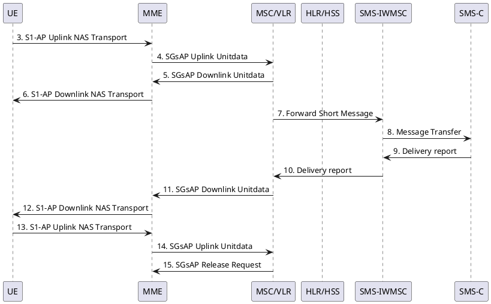
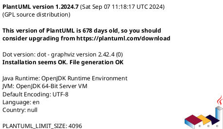

# 怎么让vuepress支持plantuml

## plantUML是啥?
看官网

## 为什么用plantuml server
好多人,应用可以一起用它, 据说还快...

另外docker不是很吊么? 赶快把 server 跑起来

### How to run the server with Docker
You can run Plantuml with jetty or tomcat container
```
docker run -d -p 8080:8080 plantuml/plantuml-server:jetty
docker run -d -p 8080:8080 plantuml/plantuml-server:tomcat
```

The server is now listing to [http://localhost:8080](http://localhost:8080).

To run plantuml using different base url, change the `docker-compose.yml` file:

~~~
args:
  BASE_URL: plantuml
~~~

And run `docker-compose up --build`. This will build a modified version of the image using
the base url `/plantuml`, e.g. http://localhost/plantuml

### windows下docker要与virtual box共存就不能用Hiper-V
只能用docker toolbox,而不是docker for windows

# 装插件 markdown-it-plantuml

```markdown
# UML example:

@startuml
Bob -> Alice : hello
@enduml
```

See [plantuml website](https://plantuml.com) for more details.

## Installation

node.js, browser:

```bash
$ npm install markdown-it-plantuml --save
```

## Basic usage

```js
const md = require('markdown-it')()
           .use(require('markdown-it-plantuml'));
```

See [markdown-it repository](https://github.com/markdown-it/markdown-it) for more details.

## Advanced usage

```js
const md = require('markdown-it')()
           .use(require('markdown-it-plantuml'), options);
```

Options:
  - __openMarker__ - optional, defaults to `@startuml`. String to use as oppening delimiter.
  - __closeMarker__ - optional, defaults to `@enduml`. String to use as closing delimiter.
  - __generateSource__ - optional, defaults to using public plant-uml server. Generates the `src` property of the image element.
  - __diagramName__ - optional, defaults to `uml`. Name used by generateSoruce to generate diagram tags like `@startuml`, `@startditaa`, etc.
  - __imageFormat__ - optional, defaults to `svg`. Format used by `generateSource` to generate the `src` of the image element.
  - __render__ - optional, defaults to markdown-it image renderer. Renderer function for opening/closing tokens.
  - __server__ - optional, defaults to `http://www.plantuml.com/plantuml`. Defines the plantuml server used for image generation.

#### Example: using custom URL to serve diagrams

```js
const options = {
  generateSource: function generateSource(umlCode) {
    return `https://your.server/plant-uml/${yourEncodeFunction(umlCode)}`;
  }
}

const md = require('markdown-it')()
           .use(require('markdown-it-plantuml'), options);
```


# 改 vuepress 的配置

```js {13}
// .vuepress/config.js
module.exports = {
...
  markdown: {
    // markdown-it-anchor 的选项
    anchor: { permalink: false },
    // markdown-it-toc 的选项
    toc: { includeLevel: [1, 2] },
    extendMarkdown: md => {
      md.set({ breaks: true })
      // md.use(require('markdown-it-plantuml'),{server: 'http://192.168.99.100:8080'})
      md.use(require('markdown-it-plantuml'),options)
    }
  },
}
const options = {
  openMarker: '```plantuml',
  closeMarker: '```',
  // imageFormat: 'png',
  server: 'http://192.168.99.100:8080',
  // server: 'http://www.plantuml.com/plantuml',
}
```

亲测有用.


# Test result. 结果



```umlcode
@startuml
version
@enduml
```



# [Todo] 将来再说支持mermaid和flow


```flow
st=>start: 开始框
op=>operation: 处理框
cond=>condition: 判断框(是或否?)
sub1=>subroutine: 子流程
io=>inputoutput: 输入输出框
e=>end: 结束框
st->op->cond
cond(yes)->io->e
cond(no)->sub1(right)->op
```
